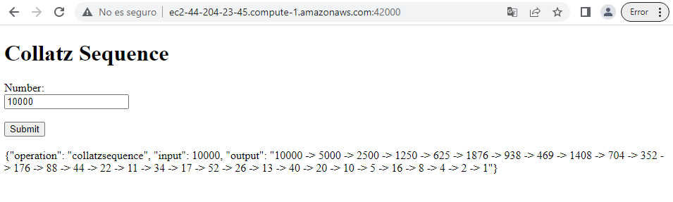
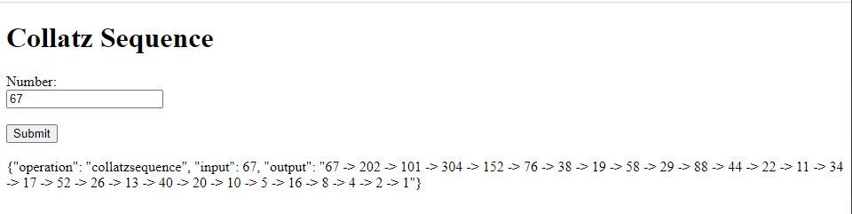

# Parcial 2

Para clonar el repositorio usaremos el siguiente comando

```
git clone https://github.com/cisfjulian/AREP_parcial2.git
```

Ahora compilaremos el proyecto

```
mvn clean install
```

Crearemos la imagen en Docker

```
docker build --tag web .
```
Ahora crearemos una referencia de la imagen pára subirla al repositorio

```
docker tag web cisfjulian/collatz
```

Haremos push al repositorio

```
docker push cisfjulian/collatz:latest
```

Ahora en la instancia de EC2 creada en AWS instalaremos Docker

```
sudo yum update -y
sudo yum install docker
```

Iniciamos el servicio

```
sudo service docker start
```

Configuramos un usuario para no usar sudo cada vez que usemos un comando docker

```
sudo usermod -a -G docker ec2-user
```

Damos exit y volvemos a entrar a la maquina para darle efecto a los cambios

Ahora correremos la imagen desde el repositorio en un contenedor 

```
docker run -d -p 42000:6000 --name web cisfjulian/collatz
```

Y tendremos el servicio ya disponible

Para este caso tenemos el url: http://ec2-44-204-23-45.compute-1.amazonaws.com:42000/

## Pruebas funcionando 





## Link a video demostrando funcionamiento!

https://youtu.be/5mpb1TgFsds
